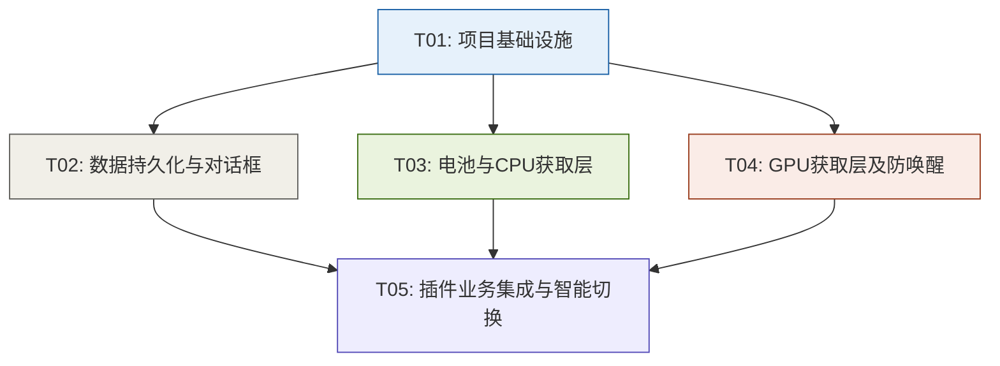

# 系统架构设计与任务分解 (System Architecture & Task Decomposition)

本项目旨在彻底重构 `power_mon_plugin` 为**纯原生 C++** 插件，完全剥离 C++/CLI 托管混合模式、.NET CLR 运行时和 `LibreHardwareMonitorLib.dll` 类库依赖。本项目针对 x86、x64、ARM64 及 ARM64EC 等平台提供全原生兼容性支持，并且将内存占用降至 2MB 以下，实现零托管启动延迟。

---

## Part A: 系统设计 (System Design)

### 1. 实现方案与技术决策 (Implementation Approach)

#### 1.1 核心技术难点与解决方案

##### (1) 去除 .NET CLR 与 CLI 元数据依赖
*   **难点**：TrafficMonitor 期待通过标准 C++ 虚函数表 (vtable) 来调用插件。原版采用 C++/CLI 编译产生混合模式二进制文件，使得程序需要拉起整个 CLR 环境，导致极高的内存占用 (30MB+) 和启动延迟，在 ARM 架构平台上甚至面临编译与加载兼容性故障。
*   **解决方案**：改用纯原生 C++17 标准，配合 MSVC 编译器以完全原生方式编译。直接根据 TrafficMonitor 官方的 `ITMPlugin` 和 `IPluginItem` C++ 接口定义虚表结构。插件仅导出唯一入口函数：
    ```cpp
    extern "C" __declspec(dllexport) ITMPlugin* TMPluginGetInstance();
    ```
    通过虚接口多态直接对接 TrafficMonitor，确保 ABI 兼容。

##### (2) 电池实时放电功耗获取 (REQ-002)
*   **难点**：原版使用 WinRT (`Windows.Devices.Power`) 查询电池，但在原生 C++ 环境下使用 C++/WinRT 会增加二进制体积，且与 ARM64EC 存在潜在的不兼容风险；而传统的 `GetSystemPowerStatus` 仅能返回充电状态与剩余百分比，无法获取具体的放电功率。
*   **解决方案**：采用 Windows 原生 DeviceIoControl 与 ACPI 电池接口通讯（`GUID_DEVINTERFACE_BATTERY`），这是最可靠的 Win32 底层原生方法：
    1.  使用 `SetupDiGetClassDevsW` 获取电池设备接口列表。
    2.  通过 `SetupDiEnumDeviceInterfaces` 枚举电池，打开电池设备句柄 (`CreateFileW`)。
    3.  使用 `DeviceIoControl` 发送 `IOCTL_BATTERY_QUERY_TAG` 获取电池的 Tag。
    4.  发送 `IOCTL_BATTERY_QUERY_STATUS` 获取电池状态结构体 `BATTERY_STATUS`。
    5.  `BATTERY_STATUS.DischargeRate` 字段提供了实时放电率（如果大于 0 且处于放电状态）。放电率单位可能为毫瓦 (mW) 或毫安 (mA)，具体取决于 `IOCTL_BATTERY_QUERY_INFORMATION` 返回的 `BATTERY_INFORMATION.Capabilities` 中的 `BATTERY_SYSTEM_SOURCE_RATE` 标志。根据该标志进行 mW 转换。
    6.  若上述接口在某些特定设备上不支持或未插电池，则回退至 WMI 命名空间 `root\WMI` 中的 `MSBatteryClass` 系列类进行查询，或置零。

##### (3) CPU 功耗获取 (REQ-003)
*   **难点**：在用户态读取 CPU MSR 寄存器（如 `0x611 MSR_PKG_ENERGY_STATUS`）以获取 CPU 功耗通常需要加载 Ring 0 内核级驱动程序，但在非管理员权限下运行驱动非常困难且存在极高安全风险。
*   **解决方案**：设计一个健壮的 `PdhPowerReader` 类，采用 Windows 性能数据助手 (PDH, Performance Data Helper) 读取性能计数器：
    1.  使用 PDH API 初始化查询：`PdhOpenQueryW`。
    2.  添加 CPU 功耗性能计数器：计数器路径为 `\Processor Information(_Total)\Processor Power`。该计数器由 Windows 系统维护（通过 Intel RAPL 或 AMD 对应机制写入性能数据），在 Win10/Win11 下可以直接在用户态无提权获取 CPU 功耗。
    3.  **回退机制**：
        *   **回退一 (WMI)**：若 PDH 初始化失败（如某些精简版系统关闭了计数器），通过 `IWbemServices` 访问 WMI 性能类 `Win32_PerfRawData_PerfOS_Processor`（或 `Win32_PerfFormattedData_PerfOS_Processor`）获取 `ProcessorPower`。
        *   **回退二 (静态估算)**：若上述均不可用，根据当前 CPU 逻辑核心数及 CPU 整体使用率 (`GetSystemTimes` 差值计算)，通过简易功耗曲线公式进行静态估算：
            $$\text{Power} = \text{TDP}_{\text{default}} \times (0.1 + 0.9 \times \text{CpuUsage})$$
            以保障界面的平滑度与显示健壮性。

##### (4) GPU 功耗获取 (REQ-006)
*   **难点**：GPU 品牌多样（主要为 NVIDIA 独显、AMD 独显、Intel 核显、AMD 核显），且双显卡轻薄本中，独显（NVIDIA dGPU）在闲置时会进入 D3 超低功耗深度休眠状态。如果频繁调用 NVML 等 API 去查询其功耗，将不断把显卡从休眠中唤醒，反而产生极大的额外电量消耗，加速电池耗尽。
*   **解决方案**：
    *   **NVIDIA**：动态加载 `nvml.dll`。为了防止频繁唤醒独显，设计 `GpuPowerReader`：
        1.  使用 `GetSystemPowerStatus` 判断当前是否处于电池供电（DC 模式）。
        2.  在 DC 模式下，将 NVIDIA NVML 的查询周期从 1 秒延长至 10 秒以上（或设计冷却计数器），或者通过 NVML 的 `nvmlDeviceGetPowerState` 判断 GPU 状态，若 GPU 处于 `P8/P12` 等最低功耗档或休眠，则直接判定为 0.0W 或低功耗状态，不发送深度查询指令，避免唤醒 GPU。
        3.  使用 `nvmlDeviceGetPowerUsage` 获取实时功耗（返回单位为毫瓦 mW，需除以 1000.0）。
    *   **AMD**：动态加载 `atiadlxx.dll` (AMD Display Library, ADL)，初始化 `ADL_Main_Control_Create`，获取 `ADL_Overdrive8_CurrentStatus_Get` 里的 `OD8Val_Power` 或 `ADL_Overdrive6_CurrentStatus_Get`，获取 AMD 显卡实时功耗。同样，在 DC 模式下实施防唤醒冷却机制。
    *   **通用回退 (D3DKMT)**：若 NVML/ADL 均不可用（或针对 Intel/AMD 核显），使用 `D3DKMTQueryAdapterInfo` 检索 GPU 性能状态数据，作为多显卡环境下的通用回退方案。

##### (5) 智能显示与状态自适应 (REQ-005)
*   **难点**：在接电（AC）与用电（DC）状态下平滑切换数据源，且要求在 2 秒内响应，无界面延迟或卡顿。
*   **解决方案**：在每秒触发的 `DataRequired()` 中，首先调用系统 API `GetSystemPowerStatus()`。根据 `ACLineStatus` 来决定数据分发逻辑：
    *   `ACLineStatus == 0` (DC 电池供电)：仅使电池放电读数生效。智能显示模式下，插件将仅显示“电池放电功率”，将 CPU/GPU 等子项的数据置零或在界面上隐藏。
    *   `ACLineStatus == 1` (AC 交流供电)：仅使硬件功耗读数生效。智能显示模式下，插件将显示“CPU+GPU 功耗总和”，将电池子项数据置零或在界面上隐藏。
    *   通过单秒轮询和内置的状态平滑过滤器（防止短时间内拔插抖动），在 1-2 秒内完成逻辑流平滑过渡。

---

### 2. 文件列表及路径 (File List)

项目的文件结构遵循头文件与实现文件分离的原则，整体物理结构组织如下：

```
├── docs/                                  # 文档目录
│   ├── class-diagram.mermaid              # 类图
│   ├── sequence-diagram.mermaid           # 时序图
│   └── architecture.md                    # 本设计文档
├── src/                                   # 源码根目录
│   ├── Framework/                         # 插件通用框架
│   │   ├── ITMPlugin.h                    # TrafficMonitor 插件标准接口头文件
│   │   ├── PluginCommon.h                 # 插件通用数据结构与常量定义
│   │   └── DllMain.cpp                    # 动态链接库入口点及导出函数导出
│   ├── Core/                              # 功耗监控核心逻辑
│   │   ├── PowerMon.h                     # ITMPlugin 实现类，主控制器
│   │   ├── PowerMon.cpp
│   │   ├── PowerMonItem.h                 # IPluginItem 实现类，子项监控项
│   │   ├── PowerMonItem.cpp
│   │   ├── SettingData.h                  # 插件配置项结构体
│   │   ├── ConfigManager.h                # 配置读取、持久化写入管理器
│   │   └── ConfigManager.cpp
│   ├── Hardware/                          # 底层硬件功耗读取封装
│   │   ├── BatteryReader.h                # Win32 DeviceIoControl 电池放电功率读取
│   │   ├── BatteryReader.cpp
│   │   ├── PdhPowerReader.h               # PDH CPU 功耗读取封装（带 WMI 及静态估算回退）
│   │   ├── PdhPowerReader.cpp
│   │   ├── GpuPowerReader.h               # GPU 功耗读取封装（动态加载 NVML/ADL/D3DKMT）
│   │   └── GpuPowerReader.cpp
│   └── UI/                                # Win32 原生对话框界面
│       ├── resource.h                     # RC 资源 ID 定义
│       ├── PowerMon.rc                    # 插件选项配置界面资源文件
│       ├── OptionsDlg.h                   # 插件配置选项对话框
│       └── OptionsDlg.cpp
├── power_mon_plugin.vcxproj               # MSVC 项目文件
└── power_mon_plugin.sln                   # Visual Studio 解决方案文件
```

---

### 3. 数据结构与接口设计 (Data Structures & Interfaces)

我们将系统的数据结构、TrafficMonitor 插件规范接口和底层功耗读取组件定义如下：

*   **`SettingData`**：配置存储结构，完全由 POD 属性构成，方便与二进制配置文件（`.ini`）映射。
*   **`PowerMon`**：主控制器，继承自 TrafficMonitor `ITMPlugin` 虚接口。
*   **`PowerMonItem`**：各个监控展示子项，继承自 `IPluginItem`。
*   **各 Reader 模块**：全部采用单例模式设计（如 `BatteryReader`、`PdhPowerReader`、`GpuPowerReader`），以便在主循环中保持长生命周期句柄，避免频繁分配销毁资源的开销。

详细的类继承和依赖关系已导出到 `docs/class-diagram.mermaid`，具体设计结构参见该文件。

---

### 4. 程序调用时序流程 (Program Call Flow)

程序的核心生命周期围绕 TrafficMonitor 的主线程轮询机制运转。每秒，TrafficMonitor 都会调用插件的 `DataRequired()` 接口。插件会在该方法内：
1.  读取当前系统供电状态（AC 还是 DC）。
2.  依据供电状态和用户设置，向各 Reader 单例发起功耗数据查询。
3.  通过各子监控项 `PowerMonItem` 格式化数值。
4.  最后，TrafficMonitor 调用 `GetItemValueText()` 获得格式化后的字符串并渲染。

详细的数据流动和控制转移时序已导出到 `docs/sequence-diagram.mermaid`，具体设计流程参见该文件。

---

### 5. 待确认与假设 (Anything UNCLEAR)

1.  **PDH 性能计数器语言本地化问题**：
    *   *假设/应对*：在某些中文或英文系统下，PDH 计数器的中文路径（如 `\Processor Information(_Total)\Processor Power`）可能与英文系统不同。设计时，`PdhPowerReader` 应优先尝试使用**标准计数器索引**（如 `\238(_Total)\6` 对应的系统数字索引）添加计数器，避免依赖字符串路径导致跨语言系统失效。
2.  **AMD GPU 功耗获取的多样性**：
    *   *假设/应对*：AMD ADL (AMD Display Library) 在不同驱动版本上暴露出获取功耗的 API 有差异（如 Overdrive 6 与 Overdrive 8）。如果加载不到 `ADL_Overdrive8_CurrentStatus_Get`，设计应平滑回退到 `ADL_Overdrive6_CurrentStatus_Get` 甚至通过 `D3DKMT` 获取。
3.  **WMI 首次初始化延迟**：
    *   *假设/应对*：WMI 初始化（`CoInitializeEx`, `CoCreateInstance`）耗时较长，如果放在 `DataRequired()` 主线程中做首次加载会导致界面瞬间卡顿。架构上约定，若使用到 WMI 回退，应在 `PdhPowerReader` 的 `Init()` 阶段（插件加载时）的后台线程中异步预初始化 WMI。

---

## Part B: 任务分解 (Task Decomposition)

### 6. 依赖包列表 (Required Packages)

由于是纯原生 C++ 重构，**严禁使用任何 C++/CLI 或托管类库**。本项目仅依赖以下 Windows SDK 底层原生库：

| 依赖库/框架 | 用途与说明 | 链接时所需依赖 (.lib) |
| :--- | :--- | :--- |
| **Windows SDK (Win32 API)** | 提供 Win32 窗口、句柄、线程及基础 API | `kernel32.lib`, `user32.lib` |
| **SetupAPI** | 用于设备接口枚举（获取电池设备路径） | `setupapi.lib` |
| **PDH (Performance Data Helper)** | 用于 CPU 功耗计数器读取 | `pdh.lib` |
| **WMI / COM SDK** | 用于 CPU 功耗回退查询 | `ole32.lib`, `wbemuuid.lib` |
| **D3DKMT** | GPU 性能查询回退 | `gdi32.lib` |
| **NVML (NVIDIA) & ADL (AMD)** | GPU 专用功耗获取接口 | 动态加载 (`LoadLibrary`) 不需要静态链接 |

---

### 7. 任务列表 (Task List)

根据任务分解规则，本设计将整个重构工程划分为**不超过 5 个**核心任务：

#### T01: 项目基础设施（基础设施与接口定义）
*   **任务说明**：创建纯原生 C++ 动态链接库项目结构，配置 MSVC 编译选项，定义 TrafficMonitor SDK 的 `ITMPlugin` 与 `IPluginItem` 原生头文件，并编写 DLL 入口文件。
*   **源文件**：
    *   `power_mon_plugin.vcxproj`
    *   `src/Framework/ITMPlugin.h`
    *   `src/Framework/PluginCommon.h`
    *   `src/Framework/DllMain.cpp`
*   **依赖项**：无
*   **优先级**：P0

#### T02: 数据持久化与 Win32 对话框（设置界面与配置管理）
*   **任务说明**：定义 `SettingData` 结构，编写 `ConfigManager` 以支持插件配置在 `.ini` 文件中的读写与持久化；使用 Win32 SDK 编写原生的插件配置属性对话框（`OptionsDlg`），允许用户配置监控开关、数字精度、显示单位和智能模式。
*   **源文件**：
    *   `src/Core/SettingData.h`
    *   `src/Core/ConfigManager.h`
    *   `src/Core/ConfigManager.cpp`
    *   `src/UI/resource.h`
    *   `src/UI/PowerMon.rc`
    *   `src/UI/OptionsDlg.h`
    *   `src/UI/OptionsDlg.cpp`
*   **依赖项**：T01
*   **优先级**：P1

#### T03: 电池与 CPU 功耗获取层（数据采集 - 电池与 CPU）
*   **任务说明**：编写 `BatteryReader` 单例，使用 `DeviceIoControl` 并借助 `GUID_DEVINTERFACE_BATTERY` 读取电池实时放电率；编写 `PdhPowerReader` 单例，使用 PDH 接口读取 `\Processor Information\Processor Power` 性能计数器，并构建 WMI 与静态估算回退链。
*   **源文件**：
    *   `src/Hardware/BatteryReader.h`
    *   `src/Hardware/BatteryReader.cpp`
    *   `src/Hardware/PdhPowerReader.h`
    *   `src/Hardware/PdhPowerReader.cpp`
*   **依赖项**：T01
*   **优先级**：P0

#### T04: GPU 功耗获取与防唤醒设计（数据采集 - GPU）
*   **任务说明**：编写 `GpuPowerReader` 单例，支持动态装载 `nvml.dll` 与 `atiadlxx.dll`。针对 NVIDIA NVML 实现防频繁唤醒独显机制，针对多显卡设备设计 D3DKMT 回退机制。
*   **源文件**：
    *   `src/Hardware/GpuPowerReader.h`
    *   `src/Hardware/GpuPowerReader.cpp`
*   **依赖项**：T01
*   **优先级**：P1

#### T05: 插件业务集成与智能切换逻辑（主控制器与监控项集成）
*   **任务说明**：实现 `PowerMon` 主控制器类和 `PowerMonItem` 插件项类。在 `DataRequired()` 中，根据 `GetSystemPowerStatus()` 检测到的供电状态和用户设置，调度各 Reader 读取数据，实现接电显示“CPU+GPU”与电池显示“电池放电率”的智能动态切换逻辑，并根据间距、字长规范格式化文本。
*   **源文件**：
    *   `src/Core/PowerMon.h`
    *   `src/Core/PowerMon.cpp`
    *   `src/Core/PowerMonItem.h`
    *   `src/Core/PowerMonItem.cpp`
*   **依赖项**：T01, T02, T03, T04
*   **优先级**：P0

---

### 8. 共享知识 (Shared Knowledge)

1.  **数据交互格式规范**：
    *   所有 Reader 读取出的功耗数值统一以**双精度浮点数 (double)** 返回，单位为**瓦特 (W)**。
    *   零值或不可读判定：若数据获取失败或未开启相关监控，Reader 函数返回 `false`，输出变量设为 `0.0`。
2.  **字符串渲染规范**：
    *   监控项的标签及值输出均采用宽字符指针 `const wchar_t*` 返回。
    *   数值渲染规则：使用 `swprintf_s` 控制格式化。数字精度受 `digit_length` 参数控制（`%.*f`）。间距受 `spacing_control` 控制，输出格式类似 `L"%s%.*f%s%s"`，其中包含标签、数值、自定义数量的间距空格及自定义单位字符（`unit_string`）。
3.  **内存管理**：
    *   严格禁止使用托管堆内存。所有 Reader 类均使用 `static` 局部静态变量实现单例，避免频繁 `new/delete`。
    *   动态加载的 DLL 句柄（如 `nvml.dll`, `atiadlxx.dll`）在 `Close()` 时统一调用 `FreeLibrary` 释放。

---

### 9. 任务依赖关系图 (Task Dependency Graph)


